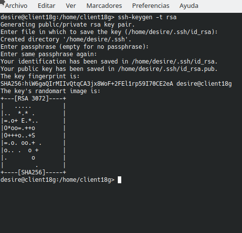

# Acceso remoto SSH

## (2.2) Primera conexión SSH GNU/Linux

- En la máquina client18g.
- ping al server18g, comprobar la conectividad con el servidor.

- nmap -Pn server18g, comprobar los puertos abiertos del servidor. Nos debe mostrar el puerto 22.

Comprobar el funcionamiento de la conexión SSH desde cada cliente usando sanchez1.
- Desde el cliente nos conectamos mediante `ssh sanchez1@server18g`.

- A partir de ahora cuando nos conectamos solo nos pide la contraseña:

- Comprobar contenido del fichero `.ssh/known_hosts` en el equipo cliente.

## (3.2) Comprobar cambio clave servidor SSH

- Comprobar que sucede al volver a conectarnos desde los dos clientes sanchez1 y sanchez2.

- Para solucionarlo leer los mensajes de advertencia.

## (5) Autenticación mediante clave pública

- Vamos a la máquina client18g
- Iniciamos sesión con el usuario desire de la máquina client18g
- ssh-keygen -t rsa para generar un nuevo par de claves para el usuario en:

  - `/home/desire/.ssh/id_rsa`
  - `/home/desire/.ssh/id_rsa.pub`

- Ahora copiaremos la clave pública (id_rsa.pub), al fichero "authorized_keys" del usuario remoto sanchez4 que está definido en el servidor.

- Comprobar que ahora al acceder remotamente vía SSH:
  - Desde client18g, NO se pide password.  
  - Desde client18w, SI se pide password.

## (6) Uso de SSH como túnel para X

- Instalar en el servidor una aplicación de entorno grafico que no este en los clientes.(GEANY)

- Modificar servidor SSH para permitir la ejecución de aplicaciones gráficas, desde los clientes. Consultar el fichero de configuración `/etc/ssh/sshd_config`(X11Forwarding yes)

- Reiniciar el servicio SSH para que se lean los cambios de configuración.

Vamos a client18g:

- zypper se Geany, comprobar que no está instalado el programa Geany.

- Vamos a comprobar desde client18g, que funciona.

  - ssh -X sanchez1@server18g, nos conectamos de forma remota al servidor, y ahora ejecutamos Geany de forma remota.

## (8.1) Restricción sobre un usuario

Vamos a crear una restricción de uso del SSH para un usuario:

- En el servidor tenemos el usuario sanchez2. Desde local en el servidor podemos usar sin problemas el usuario.
- Vamos a modificar SSH de modo que al usar el usuario por SSH desde los clientes tendremos permiso denegado.

- Consultar/modificar fichero de configuración del servidor SSH (`/etc/ssh/sshd_config`) para restringir el acceso a determinados usuarios. Consultar las opciones `AllowUser, DenyUSers`.

- `/usr/sbin/sshd -t; echo $?`, comprobar si la sintaxis del fichero de configuración del servicio SSH es correcta (Respuesta 0 => OK,1=> ERROR).

- Comprobar la restricción al acceder desde los clientes.

## (9) Servidor SSH en Windows

- Configurar el servidor Windows(2008) con los siguientes valores:

  - SO Windows Server
  - Nombre de equipo: server18s
- Añadir en `C:\Windows\System32\drivers\etc\hosts` el equipo client18g y client18w.

- Comprobar haciendo ping a ambos equipos

- Comprobar acceso SSH desde los clientes Windows

