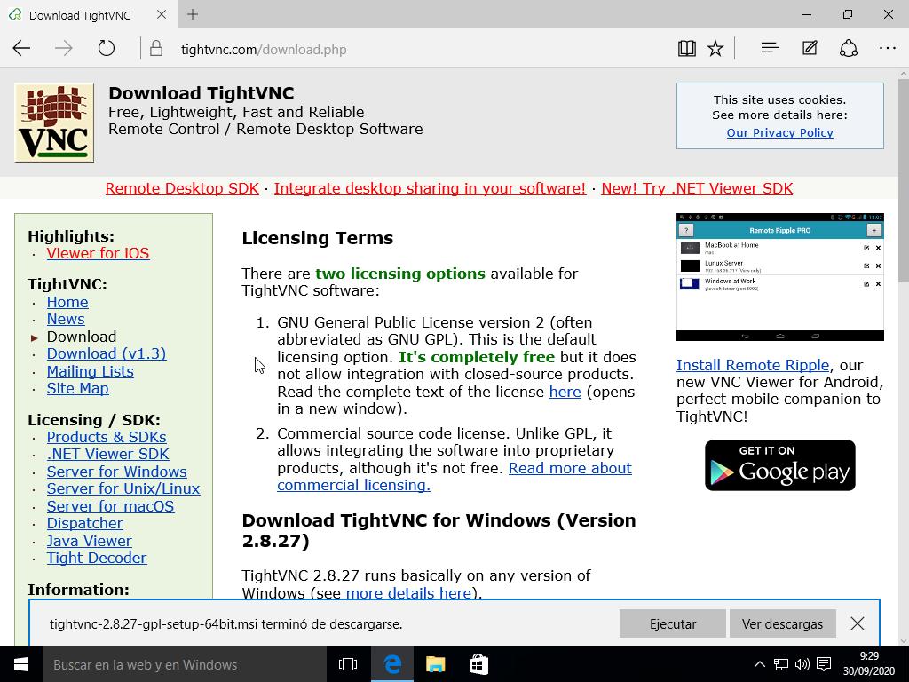

# 1. Windows: *Server*
- Configurar dos máquinas Windows (7,8,10)

  

- Descargar TightVNC.

  

- E instalar el *Server* 

- Revisar que la configuración del cortafuegos del servidor VNC Windows para permitir VNC.

  

## 1.2 Windows: *Cliente*

- En el cliente instalar `TightVNC -> Custom -> **Viewer**`.

  

## 2. Comprobaciones finales

- Conectar desde Windows *Server* hacia el Windows *Cliente*.

- Introducir la IP del cliente

  

- Y nos saldra el escritorio del cliente

- Ir al servidor VNC y usar el comando netstat -n para ver las conexiones VNC con el cliente.

