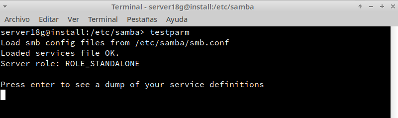

## Servidor Samba (MV1)

# (1.4) Configurar el servidor Samba

- `cp /etc/samba/smb.conf /etc/samba/smb.conf.bak`, hacer una copia de seguridad del fichero de configuración antes de modificarlo.

# (1.5) Crear los recursos compartidos de red

Vamos a configurar los recursos compartidos de red en el servidor, modificando el fichero de configuración

 > [global]
  netbios name = server18g
  workgroup = curso2021
  server string = Servidor de desire18
  security = user
  map to guest = bad user
  guest account = sambaguest
  [public]
  comment = public de desire18
  path = /srv/samba18/public.d
  guest ok = yes
  read only = yes
[castillo]
  comment = castillo de desire18
  path = /srv/samba18/castillo.d
  read only = no
  valid users = @soldados
[barco]
 comment = barco de desire18
 path = /srv/samba18/barco.d
 read only = no
 valid users = pirata1, pirata

- `testparm`, para verificar la sintaxis del fichero de configuración
- `more /etc/samba/smb.conf`, consultar el contenido del fichero de configuración

# (2.1) Cliente Windows GUI

Desde el cliente Windows vamos a acceder a los recursos compartidos del servidor Samba

- Escribimos \\192.168.1.134 o 172.19.18.130 y vemos lo siguiente.
