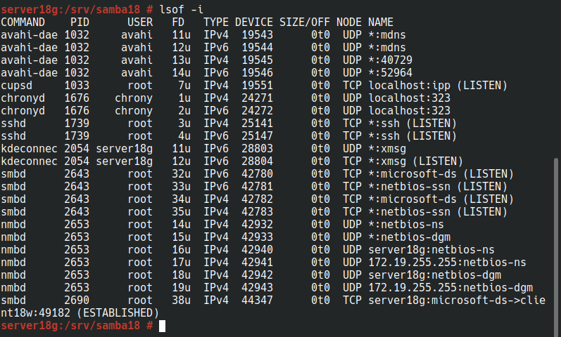
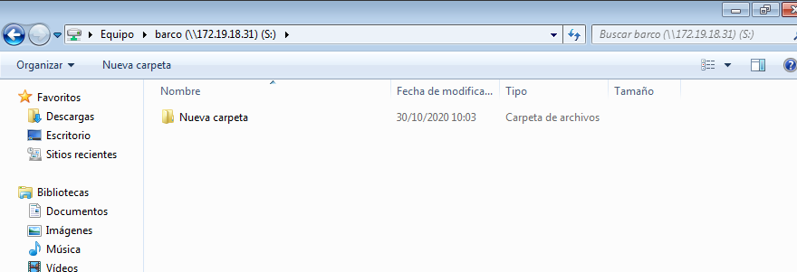
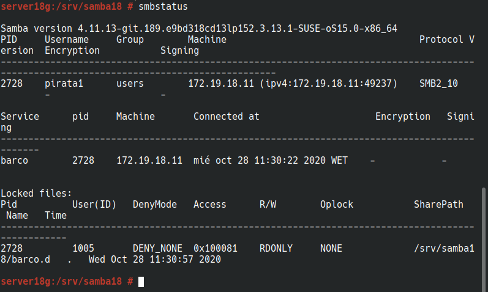
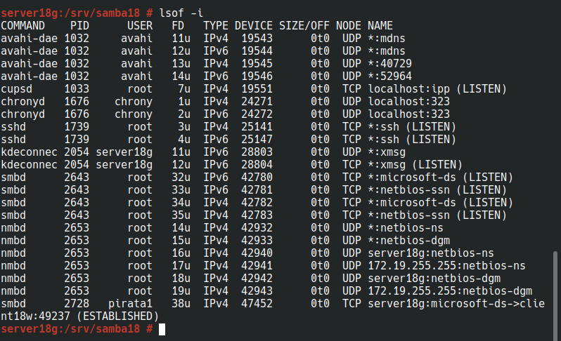

## Servidor Samba (MV1)

# (1.4) Configurar el servidor Samba

- `cp /etc/samba/smb.conf /etc/samba/smb.conf.bak`, hacer una copia de seguridad del fichero de configuración antes de modificarlo.

# (1.5) Crear los recursos compartidos de red

Vamos a configurar los recursos compartidos de red en el servidor, modificando el fichero de configuración

    [global]
      netbios name = server18g
      workgroup = curso2021
      server string = Servidor de desire18
      security = user
      map to guest = bad user
      guest account = sambaguest

    [public]
      comment = public de desire18
      path = /srv/samba18/public.d
      guest ok = yes
      read only = yes

    [castillo]
      comment = castillo de desire18
      path = /srv/samba18/castillo.d
      read only = no
      valid users = @soldados

    [barco]
      comment = barco de desire18
      path = /srv/samba18/barco.d
      read only = no
      valid users = pirata1, pirata

- `testparm`, para verificar la sintaxis del fichero de configuración
- `more /etc/samba/smb.conf`, consultar el contenido del fichero de configuración

# (2.1) Cliente Windows GUI

Desde el cliente Windows vamos a acceder a los recursos compartidos del servidor Samba

- Escribimos \\192.168.1.31 o 172.19.18.31 y vemos lo siguiente.

- Accedemos al recurso compartido "barco" con el usuario "pirata1"

  - net use para ver las conexiones abiertas

    - net use * /d /y, para borrar todas las conexiones SMB/CIFS que se han realizado.  

- Acceder al recurso compartido con el usuario pirata.
- Ir al servidor Samba.
- Comprobar los resultados

- `smbstatus`, desde el servidor Samba.

- `lsof-i`, desde el servidor Samba.

## (2.2) Cliente Windows comandos

- Abrir una shell de windows
- `net use`, para consultar todas las conexiones/recursos conectados.

- Si hubiera alguna conexión abierta la cerramos.
  - `net use * /d /y`, para cerrar las conexiones SMB.
  - `net use`, ahora vemos que no hay conexiones establecidas.

- `net view \\192.168.1.31 o 172.19.18.31`, para ver los recursos de esta máquina.

- Montar el recurso barco de forma persistente.

- `net use S: \\IP-SAMBA\barco contraseña /USER:pirata1 /p:yes` crear una conexión con el recurso compartido y lo monta en la unidad S. (con /p:yes hacemos el montaje persistente).

- `net use`, comprobamos.

- Ahora podemos entrar en la unidad S:, y crear carpetas, ficheros, etc.

- `smbstatus`, desde el servidor Samba.

- `lsof -i`, desde el servidor Samba.

# 3. Cliente GNU/Linux

## (3.1) Cliente GNU/Linux GUI

Desde el entorno gráfico de client18g, podemos comprobar el acceso a recursos compartidos SMB/CIFS.

- Vamos a una carpeta, y escribimos en la ruta `smb://172.19.18.31`.

- Probamos a crear carpetas en `barco`.

- Comprobamos en el servidor Samba:

- `smbstatus`

- `lsof -i`

# 3.2 Cliente GNU/Linux comandos

- Vamos a nuestro cliente Samba de Linux.
