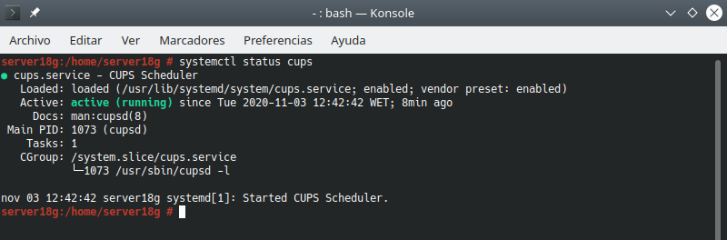
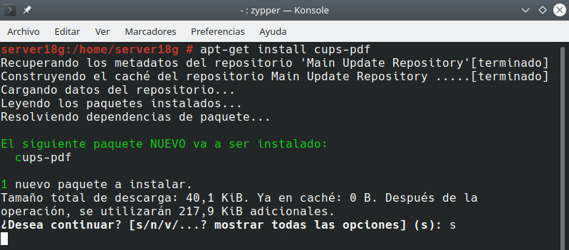
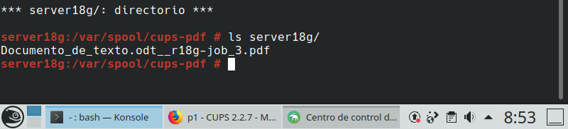

# Servidor de Impresión GNU/Linux (CUPS)
## 2. Comprobar que el Servicio está en ejecución

- Instalar el sistema de impresión de CUPS para GNU/Linux.

- `Systemctl status ...`, verificar que el servicio está en ejecución.

- Configurar CUPS `/etc/cups/cupsd.conf`:

  - `Listen *:631`

  - `<Location> Allow @LOCAL`

- `systemctl restart ...`

- A continuación, conectar a la inerfaz web de CUPS `localhost:631`

- Acceder a la seccion de Administración con el usuario/clave de root. Desde ahí acceder a la seccion `Ver archivo de registro de accesos.`

# 3. Comprobar que se imprime de forma local

Ahora vamos a usar una impresora de forma local en el servidor de impresión.

- Instalar el paquete `cups-pdf` que nos permite hacer uso de una impresora virtual PDF local. Usaremos esta impresora virtual para las pruebas en caso de no disponer de una impresora real => `apt-get install cups-pdf`.

- Crear un archivo TXT o ODT con algún contenido.

- Imprimir el documento en la impresora local.

- Comprobar el resultado. Los trabajos de impresión de la impresora virtual PDF se guardan en alguno de estos directorios.

  >/home/desire/PDF
  >/var/spool/cups-pdf/server18g

# 4. Comprobar que se imprime de forma remota

En el Servidor
- Habilitar la impresora como recurso de red compartido.

En el cliente

- Agregar impresora de red.

- Crear un archivo TXT u ODT con algún contenido.

- Imprimir el documento en la impresora remota.

- Comprobar desde el servidor que se ha realizado la impresión remota.

