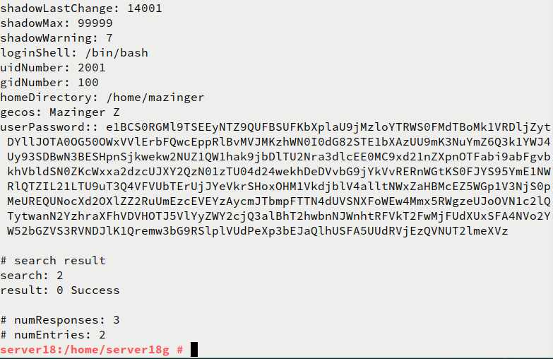

# Servicion de DIrectorio con comandos

## (2.4) Comprobar contenido del DS LDAP

- `ldapsearch -b "dc=ldap18,dc=curso2021" -x | grep dn`, muestra el contenido de nuestra base de datos LDAP, "dn" significa nombre distinguido, es un identificador que tiene cada nodo dentro del árbol LDAP.

- `ldapsearch -H ldap://localhost -b "dc=ldap18,dc=curso2021" -W -D "cn=Directory Manager" | grep dn`, en este caso hacemos la consulta usando usuario/clave.

## (3.3) Comprobar nuevo usuario
Estamos usando la clase `posixAccount`, para almacenar usuarios dentro de un directorio LDAP. Dicha clase posee el atributo uid. Por tanto, para listar los usuarios de un directorio, podemos filtrar por "(uid=*)".

- `ldapsearch -W -D "cn=Directory Manager" -b "dc=ldap18,dc=curso2021" "(uid=*)"`, para comprobar si se ha creado el usuario correctamente en el LDAP.

## (4.3) Comprobar los usuarios creados

- Ir a la MV cliente LDAP.

- `nmap -Pn 172.19.18.32`, comprobar que el puerto LDAP del servidor está abierto. Si no aparecen los puertos abiertos, entonces revisar el cortafuegos.

- `ldapsearch -H ldap://172.19.18.32 -W -D "cn=Directory Manager" -b "dc=ldap18,dc=curso2021" "(uid=*)" | grep dn` para consultar los usuarios LDAP que tenemos en el servicio de directorio remoto.

