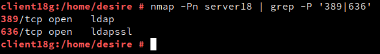
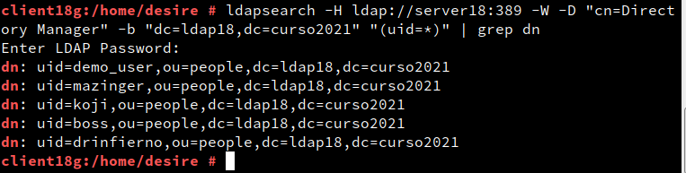
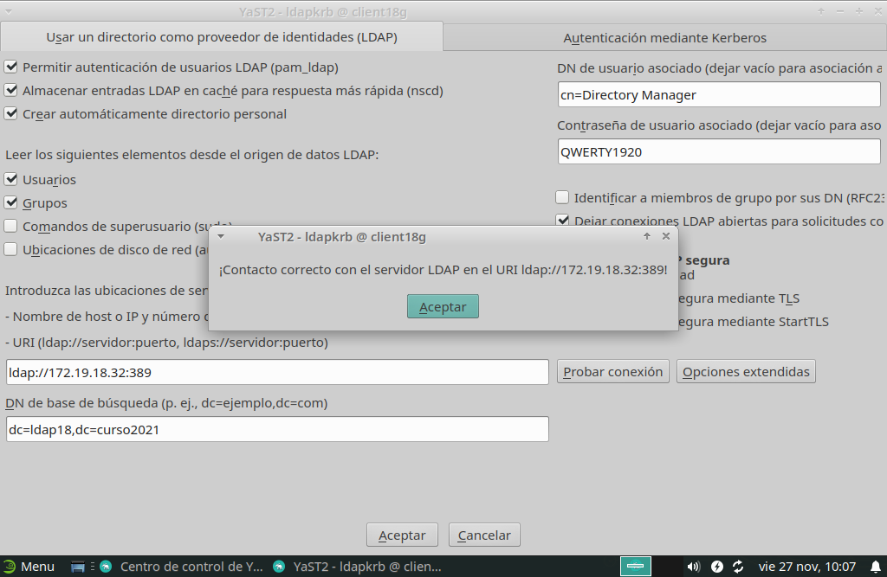
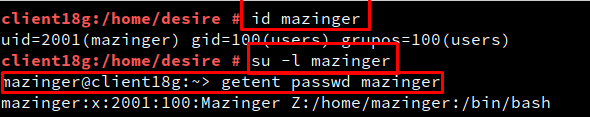
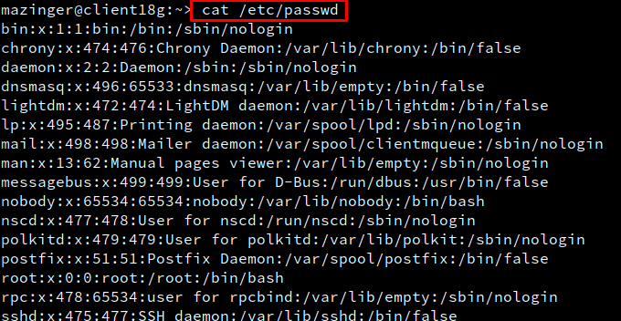

# Cliente para autenticación LDAP

# 1. Preparativos

Comprobamos el acceso al LDAP desde el cliente:
- Ir a MV cliente
- `nmap -Pn 172.19.18.31|grep -P '389|636'`, para comprobar que el servidor LDAP es accesible desde la MV2 Cliente

- `ldapsearch -H ldap://172.19.18.31:389 -W -D "cn=Directory Manager" -b "dc=ldap18,dc=curso2021" "(uid=*)" | grep dn`, comprobamos que los usuarios del LDAP remoto son visibles en el cliente.

# 2. Configurar autenticación LDAP

## 2.1 Crear conexión con servidor

Vamos a configurar de la conexión del cliente con el servidor LDAP.

- Ir a la MV cliente.

- No aseguramos de tener bien el nombre del equipo y nombre de dominio (/etc/hostname,/etc/hosts).

- Ir a `Yast -> Cliente LDAP y Kerberos`.

- Configurar como la imagen de ejemplo:

  - BaseDN: `dc=ldap18,dc=curso2021`

  - DN de usuario: `cn=Directory Manager`

  - Contraseña: CLAVE del usuario cn=Directory Manager

  

- Al final usar la opción de `Probar conexión`.

## 2.2 Comprobar con comandos

- Vamos a la consola con ususario root, y probamos lo siguiente:

