# Vagran con VirtualBox

## (3.3) Comprobar proyecto 1
Vamos a crear una MV nueva y la vamos a iniciar usando Vagrant:
- Debemos estar dentro de `vagrant18-celtics`.
- `vagrant up`, para iniciar una nueva instancia de la máquina.

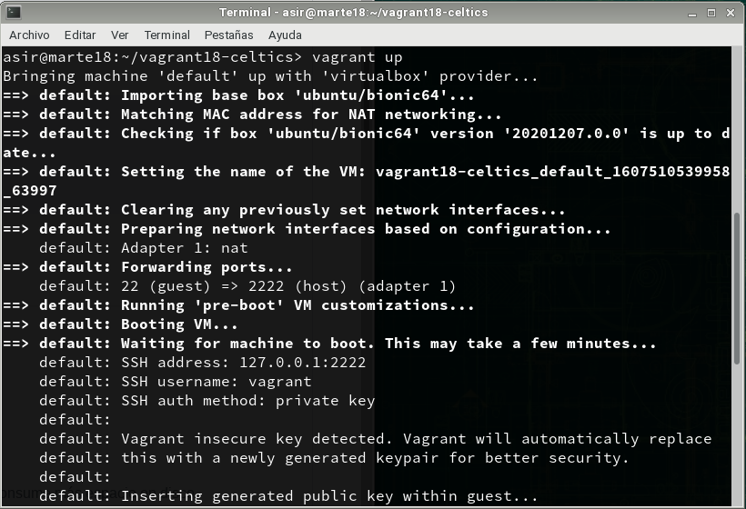

- `vagrant ssh`: Conectar/entrar en nuestra máquina virtual usando SSH.

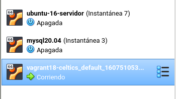

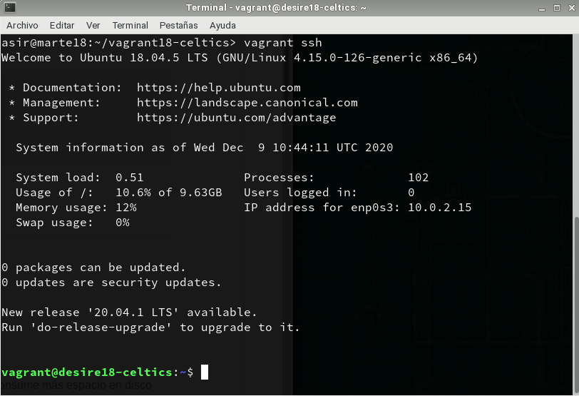

## (5.2) Comprobar proyecto 2
Para confirmar que hay un servicio a la escucha en 4567, desde la máquina real podemos ejecutar los siguientes comandos:

- En el HOST-CON-VAGRANT. Comprobaremos que el puerto 4567 está a la escucha.
  - `vagrant port` para ver la redirección de puertos de la máquina Vagrant.

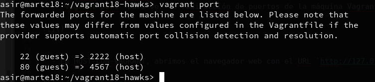

  - En HOST-CON-VAGRANT, abrimos el navegador web con el URL `http://127.0.0.1:4567`.

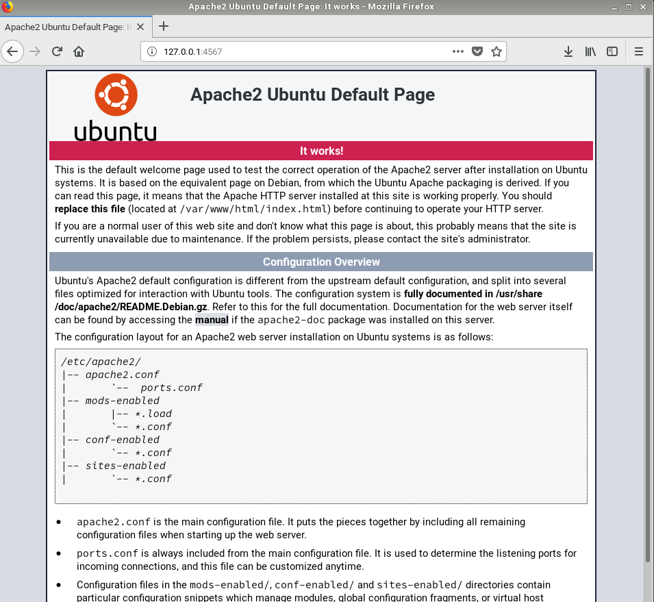

## (6.1) Suministro Shell Script
Ahora vamos a suministrar a la MV un pequeño script para instalar Apache.
- Crear directorio `vagrant18-lakers` para nuestro proyecto.

- Entrar en dicha carpeta.

- Crear fichero `html/index.html` con el siguiente contenido:

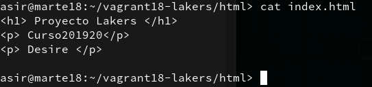

- Crear el script `install_apache.sh`, dentro del proyecto con el siguiente contenido:

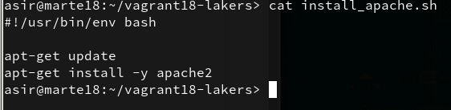

Iniciar en el fichero de configuración `Vagrantfile` lo siguiente:

> config.vm.hostname = "desire18-lakers"
  config.vm-provision :shell, :path => "install_apache.sh"
  config.vm.synced_folder "html", "/var/www/html"

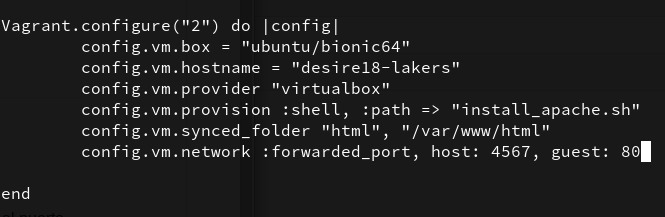

- `vagrant up`, para crear la MV.

- Para verificar que efectivamente el servidor Apache ha sido instalado e iniciado, abrimos navegador en la máquina real con URL `http://127.0.0.1:4567`.

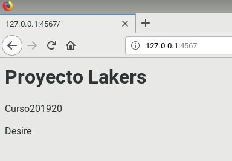

## (6.2) Suministro Puppet

Se pide hacer lo siguiente.

- Crear directorio `vagrant18-raptors` como nuevo proyecto Vagrant.
- Modificar el archivo `Vagrantfile` de la siguiente forma:

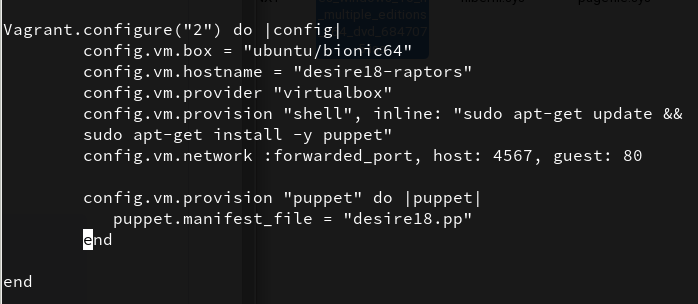

- Ahora hay que crear el fichero `manifests/desire18.pp`, con las órdenes/instrucciones Puppet para instalar un programa determinado.

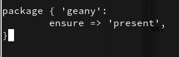

- Para que se apliquen los cambios de configuración, hacemos `vagrant relodad o restart`.

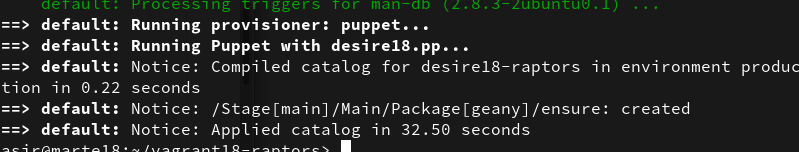

## (7.2) Crear Box Vagrant

Una vez hemos preparado la máquina virtual ya podemos crear el box.

- Vamos a crear una nueva carpeta `vagrant18-bulls`, para este nuevo proyecto vagrant.

- `VBoxManage list vms`, comando de VirtualBox que muestra los nombres de nuestras MVs. Elegir una de las máquinas (VMNAME).

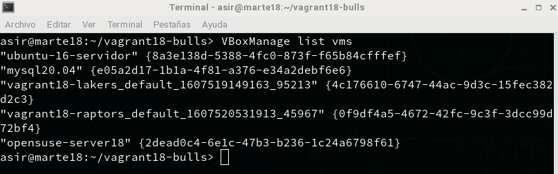

- Nos aseguramos que la MV de VirtualBox VMNAME está apagada.

- `vagrant package --base VMNAME desire18.box`, para crear nuestra propia caja.

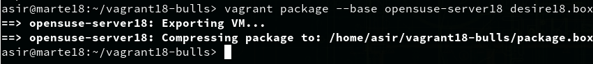

- Comprobamos que se ha creado el fichero `package.box` en el directorio donde hemos ejecutado el comando.

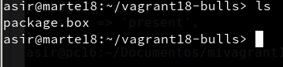

- `vagrant box add desire/bull package.box`, añadimos la nueva caja creada por nosotros, al repositorio local de cajas vagrant de nuestra máquina.

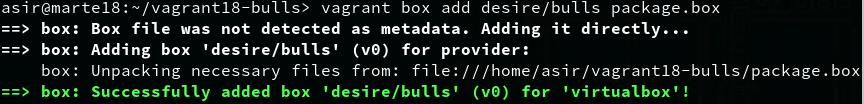

- `vagrant box list`, consultar ahora la lista de cajas Vagrant disponibles.

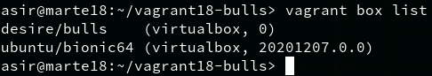
