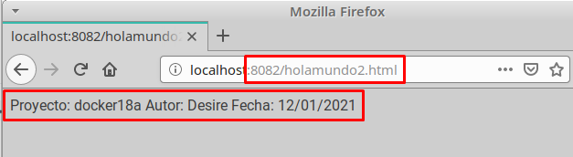

# Contenedores con Docker

## 3.2. Comprobar
- Abrimos una nueva terminal
- `docker ps`, nos muestra los contenedores en ejecución. Podemos apreciar que la última columna nos indica que el puerto 80 del contenedor está redireccionado a un puerto local `0.0.0.0.:PORT -> 80/tcp`.


- Abrir navegador web y poner URL `0.0.0.0.:PORT`. De esta forma nos conectaremos con el servidor Nginx que se está ejecutando dentro del contenedor.


- Comprobar el accceso a `holamundo1.html`.


- Paramos el contenedor `app2nginx1` y lo eliminamos.


Como ya tenemos una imagen docker con Nginx (Servidor Web), podremos crear nuevos contenedores cuando lo necesitemos.

## 3.3. Migrar

*Exportar* imagen Docker a fichero tar:

- `docker save -o alumno18docker.tar desire/nginx1`, guardamos la imagen "nombre-alumno/nginx1" en un fichero tar.


Intercambiar nuestra imagen exportada con la de un compañero de clase.

*Importar* imagen Docker desde fichero:

- Coger la imagen de un compañero de clase.


- Nos llevamos el tar a otra máquina con docker instalado, y restauramos.
- `docker load -i alumno18docker.tar`, cargamos la imagen docker a partir del fichero tar. Cuando se importa una imagen se muestra en pantalla las capas que tiene.
- `docker images`, comprobamos que la nueva images está disponible.


- Probar a crear un contenedor (`app3alumno`), a partir de la nueva imagen.


## 4.2. Crear imagen Dockerfile
El fichero Dockerfile contiene toda la información necesaria para construir el contenedor, veamos:

- `cd docker18a`, entramos al directorio con el Dockerfile.

- `docker build -t desire/nginx2 .`, construye una nueva imagen a partir del Dockerfile. *El punto final es necesario*.


- `docker images`, ahora debe aparecer nuestra nueva imagen.


## 4.3. Crear contenedor

A continuación vamos a crear un contenedor con el nombre `app4nginx2`, a partir de la imagen `desire/nginx2`. Probaremos con:

`docker run --name=app4nginx2 -p 8082:80 -t desire/nginx2`


Desde otra terminal:

- `docker ps`, para comprobar que el contenedor está en ejecución y en escucha por el puerto deseado.


- Comprobar en el navegador:

- URL `http://localhost:8082`


- URL `http://localhost:8082/holamundo2.html`



# 4.4. Usar imagen de nginx

- Crear el directorio `docker18b`. Entrar al directorio.

- Crear fichero `holamundo3.html` con:
  - Proyecto:docker18b
  - Autor: Desire
  - Fecha: Fecha actual


- Crea el siguiente `Dockerfile`
````
  FROM nginx
  COPY holamundo3.html /usr/share/nginx/html
  RUN chmod 666 /usr/share/nginx/html/holamundo3.html
````


- Poner en el directorio `docker18b` los ficheros que se requieran para construir el contenedor.
- `docker build -t desire/nginx3 .`, crear la imagen.


- `docker run --name=app5nginx3 -d -p 8083:80 desire/nginx3`, crear contenedor.


- Comprobar el acceso a `holamundo3.html`.


# 5. Hola Mundo
Ahora vamos a crear un contenedor "holamundo" y subirlo a Docker Hub.

- Crear carpeta `docker18c`. Entrar en la carpeta.


- Crear fichero Dockerfile de modo que al ejecutar `docker run desire/holamundo` se mostrará en pantalla el mensaje siguiente:

>Hola Mundo!
nombre-del-alumnoXX
Proyecto dockerXXc
Fecha actual


- Registrarse en Docker Hub.


- `docker login`, para abrir la conexión.


- `docker push ...`, para subir la imagen a los repositorios de Docker.


