# Salt-stack

## 3.4. Comprobar la conectividad
Desde el Máster comprobamos:

1. Conectividad hacia los Minions.

````
# salt '*' test.ping
minion18g:
  True
````

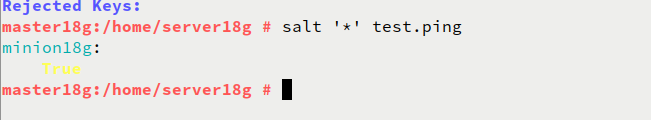


2. Versión de Salt instalada en los Minions.

````
# salt '*' test.version
minion18g:
  2019.2.0
````
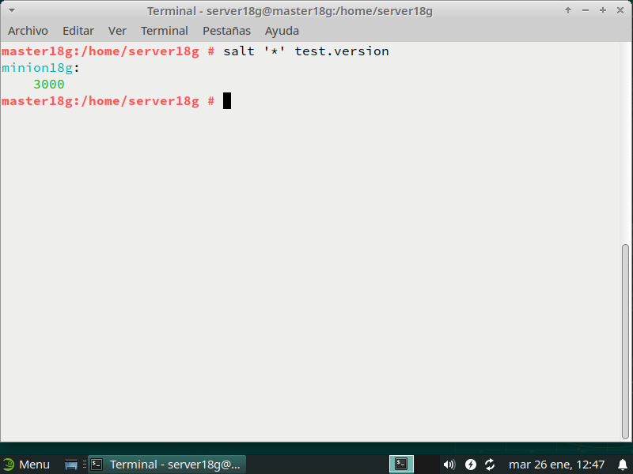

## 4.5. Aplicar estado (apache)
Ir al Master:

- Consultar los estados en detalle y verificar que no hay errores en las definiciones.

  - `salt '*' state.show_lowstate`

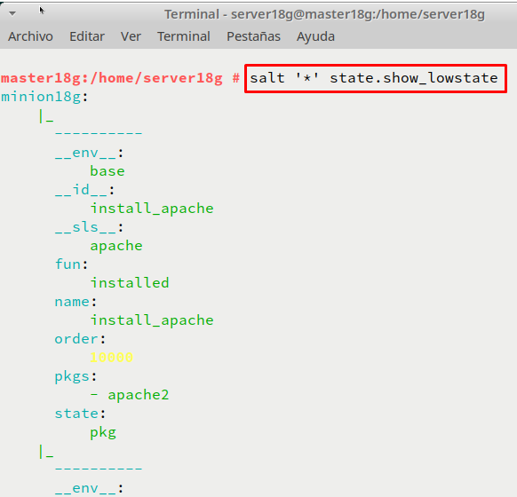

  - `salt '*' state.show_highstate`,

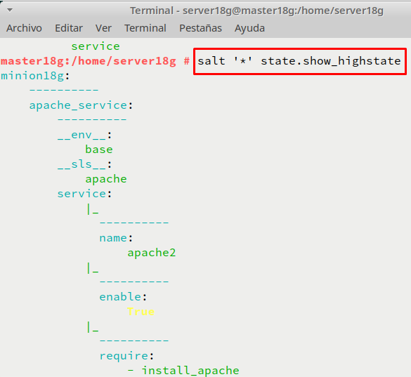

- `salt '*' state.apply apache`, para aplicar el nuevo estado en todos los minions.

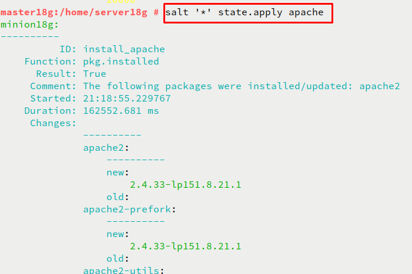


`````
minion18g:
----------
          ID: install_apache
    Function: pkg.installed
      Result: True
     Comment: The following packages were installed/updated: apache2
              ...
----------
          ID: apache_service
    Function: service.running
        Name: apache2
      Result: True
     Comment: Service apache2 has been enabled, and is running
              ...

Summary for minion18g
------------
Succeeded: 2 (changed=2)
Failed:    0
------------
Total states run:     2
Total run time: 105.971 s

`````

## 5.1. Aplicar estado (users)
Vamos a crear un estado llamado `users` que nos servirá para crear un grupo y usuarios en las máquinas Minions.

- Crear directorio `/srv/salt/bases/users`.
- Crear fichero `/srv/salt/base/users/init.sls` con las deficiones para crear lo siguiente:
  - Grupo `mazingerz`
  - Usuarios `koji18`, `drinfierno18` dentro de dicho grupo.

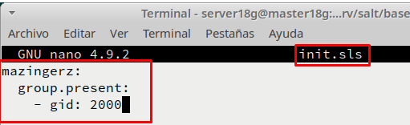

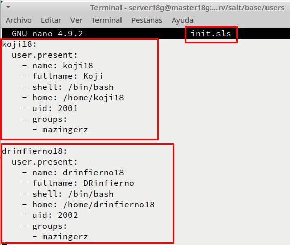

- Aplicar el estado.

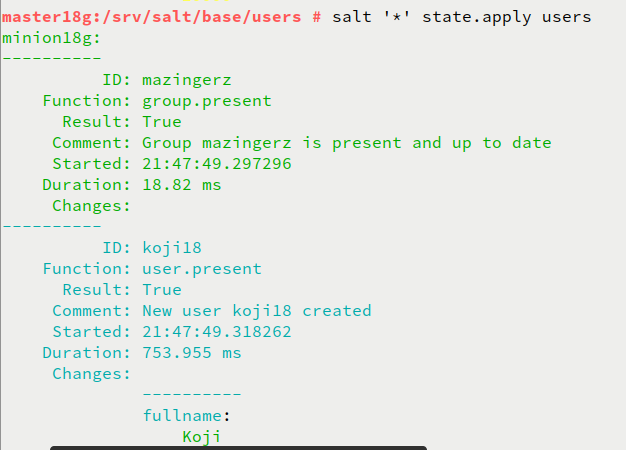

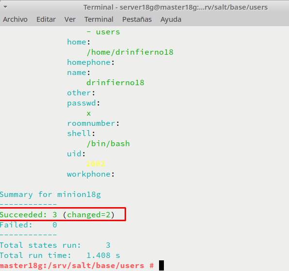

## 5.2. Aplicar estado (files)

- Crear estado `dirs` para crear las carpetas `private`(700), `public`(755) y `group`(750) en el HOME del usuario `koji`.

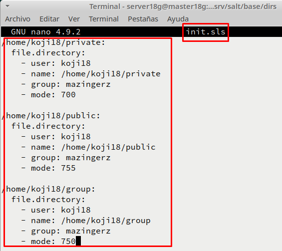

- Aplicar el estado `dirs`.

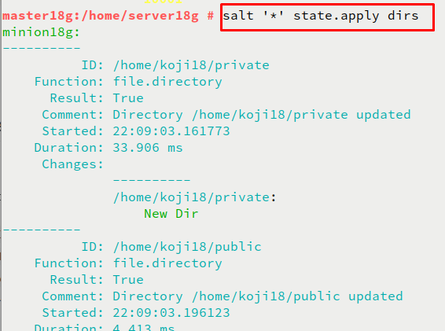

## 5.3. Ampliar estado "apache"

- Crear el fichero `/srv/salt/base/files/holamundo.txt`. Escribir dentro el nombre del alumno y la fecha actual.

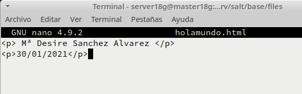

- Incluir en el estado "apache" la creación del fichero "holamundo" en el Minion. Dicho fichero se descargará desde el servidor Salt Máster y se copiará en el Minion.

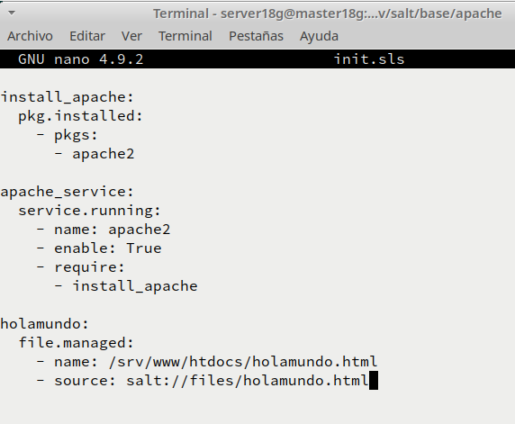

``````
holamundo:
  file.managed:
    - name: /srv/www/htdocs/holamundo.html
    - source: salt://files/holamundo.html
``````

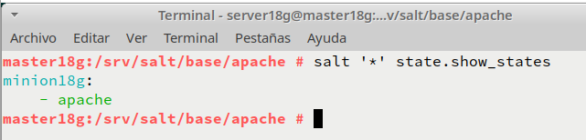

- Ir al master y aplicar el estado "apache".

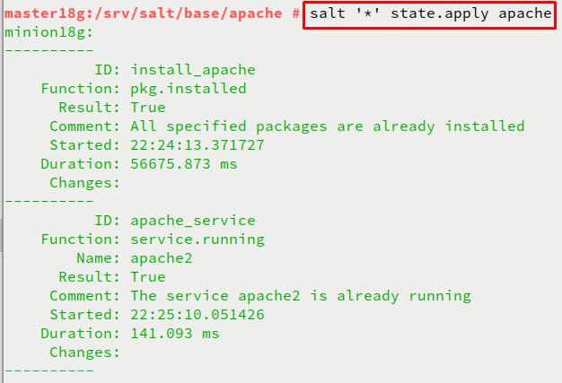

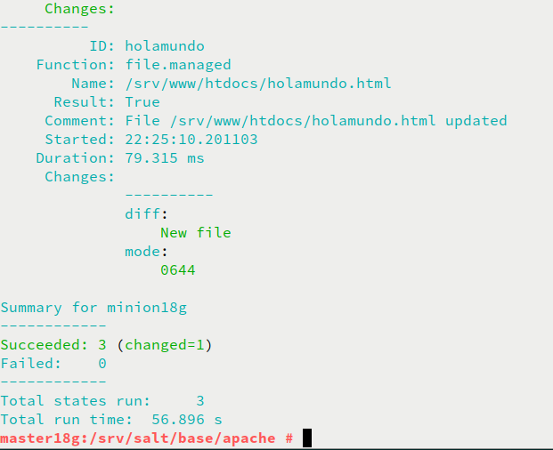
